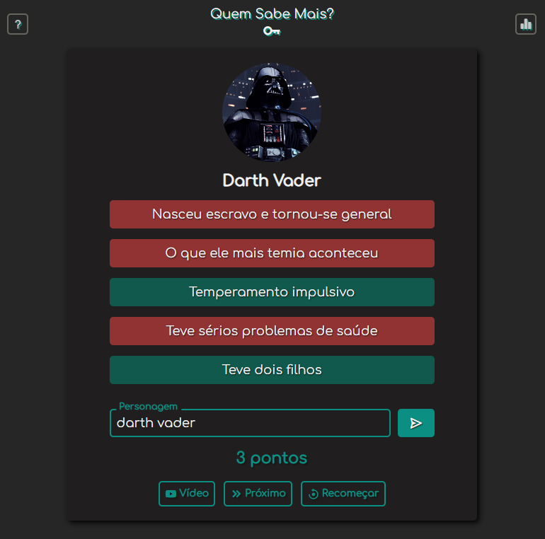

## Quem Sabe Mais? 

É um jogo inspirado pelo quadro [Quem Sabe Mais?](https://www.youtube.com/playlist?list=PLZ1moeoh2N0O7fLnOHcJ-8VLI5Zhh9q1a) do canal [Cadê a Chave?](https://www.youtube.com/c/cadeachave), porém adaptado para ser jogado por apenas uma pessoa.

O objetivo é adivinhar uma personalidade ou personagem com 5 dicas sobre ele, que podem ser acessadas clicando nelas, na ordem desejada. Quanto mais dicas forem necessárias para adivinhar o personagem, menos pontos são recebidos ao acertar. 

Para fazer uma tentativa, é necessário escrever o nome do personagem e enviá-lo, após já ter visto pelo menos uma dica. 
A cada rodada, uma nova personalidade é sorteada dentre as disponíveis (ainda não jogadas). Para cada acerto, os pontos são acumulados e é possível ver qual foi a maior pontuação alcançada.

No jogo, todos os personagens e todas as 5 dicas de cada um vem diretamente dos episódios do quadro [Quem Sabe Mais?](https://www.youtube.com/playlist?list=PLZ1moeoh2N0O7fLnOHcJ-8VLI5Zhh9q1a), assim, quando um personagem é revelado, também é possível acessar o vídeo em que ele aparece, exatamente no momento que ele foi jogado. 



### Tecnologias 
<div style="display: flex; gap: 5px;">
    
    
    
    
</div>

### Execução
Para executar o projeto bastar clonar o repositório com o link abaixo:
```bash
git clone https://github.com/gabriel-piva/quemSabeMais.git
```
Em seguida, navegue até a pasta, instale as dependências com `npm install` e inicie o compilador TypeScript com `npm start`, que monitorará os arquivos _.ts_ para compilação automática. É necessário o [Node.js](https://nodejs.org/pt-br) instalado para executar esses comandos.

Por fim, abra o arquivo `index.html` em algum servidor web.

### Referências
A biblioteca de ícones foi a [Boxicons](https://boxicons.com/), a fonte vem do [Google Fonts](https://fonts.google.com/specimen/Comfortaa) e o ícone da página, juntamente com todas as dicas e personagens foram retirados dos vídeos do [Cadê a Chave?](https://www.youtube.com/c/cadeachave).